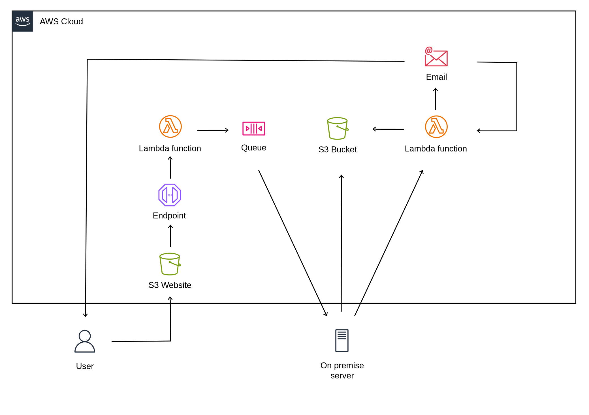

# Text To Image Server

https://symbolfigures.io/t2i.html

A text to image server that facilitates use of [Stable Diffusion 3.5 Large](https://huggingface.co/stabilityai/stable-diffusion-3.5-large).

1. The end user visits the [front end](aws/s3/t2i.html), and places an order.

2. The order is sent to an API Gateway endpoint. API Gateway passes it to a [Lambda function](aws/lambda/t2i-server-sqs.py), which passes it to an SQS queue.

3. Meanwhile an on-premise [server](server.py) is running and polling the queue at regular intervals. If it isn't busy, it starts on the next order in the queue.

4. Once the images are generated, they are uploaded to S3.

5. Then another [Lambda function](aws/lambda/t2i-server-presigned.py) is invoked. This creates a pre-signed URL and emails it to the end user via SES.

6. The pre-signed URL expires after 24 hours. The email includes a link to invoke the Lambda function again to generate a new pre-signed URL.

